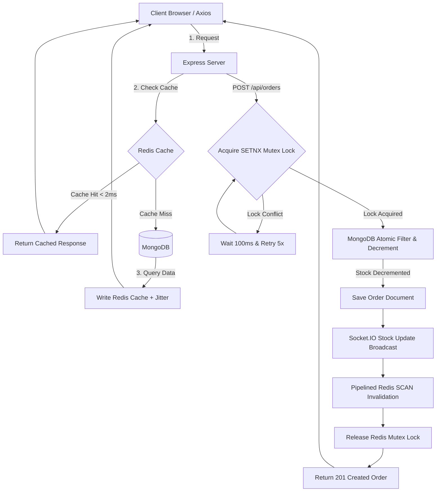

# High-Performance E-Commerce Engine with AI Vector Search
### Infotact solutions & co. - SDE Team Project (Month 2)

A production-grade, high-performance e-commerce catalog and ordering engine built with **Node.js, Express, TypeScript, Mongoose, Redis, Socket.IO, React 19, Vite, and Docker**. 

---

## 🏗️ System Architecture Flow

This diagram illustrates how client requests flow through our double-layered caching and transactional lock checkpoints:



---

## 🧠 Offline AI Vector Semantic Search Pipeline

The backend uses a local, CPU-based Hugging Face Transformers.js pipeline (`all-MiniLM-L6-v2`) to compute semantic vector embeddings offline with zero external API fees:

```mermaid
graph LR
    UserQuery[Search Text: "running gear"] --> Extractor[Transformers.js all-MiniLM-L6-v2]
    Extractor -->|Generate 384-D Vector| VectorArray[Query Embedding Array]
    VectorArray --> VectorQuery[(MongoDB Atlas Vector Search)]
    VectorQuery -->|Cosine Similarity match| TopResults[Top 10 Semantically Similar Products]
    TopResults --> ClientDisplay[Storefront Results Grid]
```

---

## 📁 Core Repository Directory Structure

```
infotact-project2/
├── .github/workflows/main.yml  # GitHub Actions CI lint & build check
├── client/                     # React 19 + Vite 7 Frontend
│   ├── src/
│   │   ├── components/         # Storefront catalog, cart, and checkout UI
│   │   ├── context/            # Auth and Cart state contexts
│   │   ├── hooks/              # Socket.IO client integrations
│   │   └── index.css           # Tailwind CSS v4 variables
├── server/                     # Node.js + Express + TypeScript Backend
│   ├── src/
│   │   ├── config/             # DB & Redis connection pools
│   │   ├── middleware/         # Caching middlewares and JWT guard RBAC
│   │   ├── models/             # User, Product, and Order schemas
│   │   ├── services/           # Redis Lock & Transformers.js services
│   │   ├── routes/             # REST Endpoints
│   │   ├── socket/             # Socket.IO connection configurations
│   │   └── scripts/            # Database seeders and benchmark scripts
│   ├── Dockerfile              # Multi-stage production container config
│   └── tsconfig.json           # Node16 resolution settings
```

---

## 📡 Core API Endpoints

### Catalog & Caching (Week 2)
* **`GET /api/products`**: Fetch paginated products catalog. Cached via Cache-Aside wrapper.
* **`GET /api/products/:id`**: Fetch product details. Cached via Cache-Aside wrapper.
* **`GET /api/products/search/keyword?query=...`**: Regular case-insensitive regex keyword query.
* **`POST /api/products`** (Admin): Create product. Invalidates all stale pages & details cache keys instantly using pipelined Redis `SCAN` eviction.

### Semantic Search & Orders (Week 3 & 4)
* **`GET /api/products/semantic-search?query=...`**: AI-powered semantic catalog search.
* **`POST /api/orders`**: Secure purchase checkout guarded by Redis Mutex Locks + MongoDB Atomic Filter decrement. Broadcasts live inventory count updates.
* **`GET /api/orders/my-orders`**: Retrieve client's order purchase history.

---

## ⚡ Execution & Verification Scripts

Commands must be executed inside the `server/` directory:

1. **Install Dependencies**:
   ```bash
   npm install
   ```
2. **Seed Catalog (1,000 products with vector embeddings)**:
   ```bash
   npm run seed
   ```
3. **Run Caching & Latency Integration Tests**:
   ```bash
   npm run test:cache
   ```
4. **Run High-Concurrency Checkout Tests**:
   ```bash
   npm run test:concurrency
   ```
5. **Run TypeScript Compiler Audit Check**:
   ```bash
   npm run audit
   ```
6. **Start Dev Server**:
   ```bash
   npm run dev
   ```