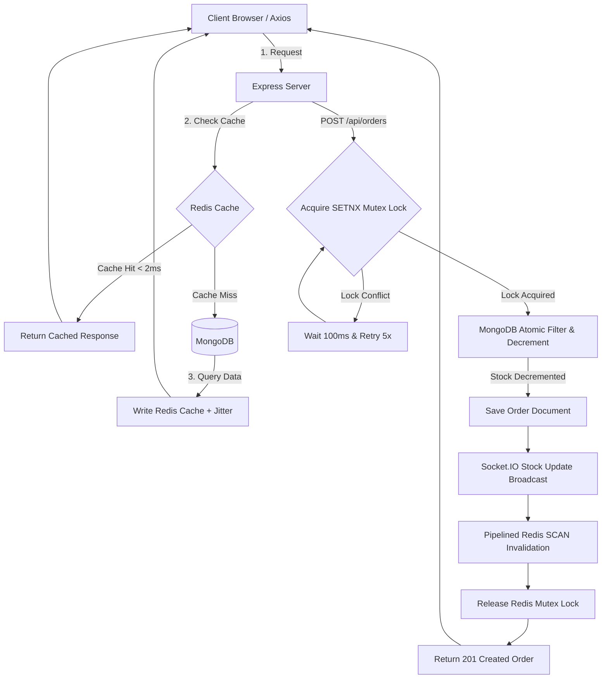

# 🛒 ShopSphere: High-Performance E-Commerce Engine with AI Vector Search
### Infotact Solutions & Co. - SDE Team Project

A production-grade, high-performance full-stack e-commerce catalog and ordering engine built using **Node.js, Express, TypeScript, Mongoose, Redis, Socket.IO, React 19, Vite, and Tailwind CSS**.

---

## 🏗️ System Architecture Flow

This diagram illustrates how client requests flow through our double-layered caching and transactional lock checkpoints:



---

## 🧠 Offline AI Vector Semantic Search Pipeline

The backend uses a local, CPU-based Hugging Face Transformers.js pipeline (`all-MiniLM-L6-v2`) to compute semantic vector embeddings offline with zero external API fees:

```mermaid
graph LR
    UserQuery[Search Text: "running gear"] --> Extractor[Transformers.js all-MiniLM-L6-v2]
    Extractor -->|Generate 384-D Vector| VectorArray[Query Embedding Array]
    VectorArray --> VectorQuery[(MongoDB Atlas Vector Search / Local Fallback)]
    VectorQuery -->|Cosine Similarity match| TopResults[Top 10 Semantically Similar Products]
    TopResults --> ClientDisplay[Storefront Results Grid]
```

---

## 🚀 Key Features

### Customer
- **User Onboarding**: Secure registration and login with JWT and hashed passwords.
- **Product Catalog**: Beautiful storefront loaded under 2ms using Redis.
- **AI Semantic Search**: Search conceptually (e.g. "winter clothes" matches "hooded jacket").
- **Cart & Wishlist**: Interactive client-side checkout basket management.
- **Checkout & Inventory**: Safe orders secured by Redis Mutex Locks to block double-selling.
- **Real-Time Updates**: Live stock changes broadcasted instantly using Socket.IO.
- **Order Tracking**: Historic purchase logs and status tracking dashboard.

### Admin
- **Catalog Management**: Add, update, and delete catalog products.
- **Auto AI Embeddings**: Automatically computes vector embeddings on product creation/update.
- **Invalidation Pipeline**: Evicts stale Redis cache pages on catalog modifications.

---

## 🛠 Tech Stack

- **Frontend**: React 19, TypeScript, Vite, Tailwind CSS, React Router, Axios
- **Backend**: Node.js, Express.js, TypeScript, MongoDB, Mongoose, Redis, Socket.IO, Hugging Face Transformers.js
- **DevOps**: Docker, GitHub Actions CI

---

## 📂 Core Repository Directory Structure

```
infotact-project2/
├── .github/workflows/main.yml  # GitHub Actions CI lint & build check
├── client/                     # React 19 + Vite Frontend
│   ├── src/
│   │   ├── components/         # Storefront catalog, cart, and checkout UI
│   │   ├── context/            # Auth and Cart state contexts
│   │   ├── hooks/              # Socket.IO client integrations
│   │   ├── pages/              # Onboarding, Catalog, details, and admin pages
│   │   └── services/           # Axios API services
│   └── package.json
└── server/                     # Node.js + Express + TypeScript Backend
    ├── src/
    │   ├── config/             # DB & Redis connection pools
    │   ├── middleware/         # Caching middlewares and JWT guard RBAC
    │   ├── models/             # User, Product, and Order schemas
    │   ├── services/           # Redis Lock & Transformers.js services
    │   ├── routes/             # REST Endpoints
    │   ├── socket/             # Socket.IO connection configurations
    │   └── scripts/            # Database seeders and benchmark scripts
    ├── Dockerfile              # Multi-stage production container config
    └── tsconfig.json           # Node16 resolution settings
```

---

## 📡 Core API Endpoints

### Auth
* **`POST /api/auth/register`**: Register a new user session.
* **`POST /api/auth/login`**: Authenticate and return JWT token.

### Catalog & Caching
* **`GET /api/products`**: Fetch paginated products catalog (Cached).
* **`GET /api/products/:id`**: Fetch product details (Cached).
* **`GET /api/products/search/keyword?query=...`**: Case-insensitive regex keyword query.
* **`GET /api/products/semantic-search?query=...`**: AI-powered semantic vector search.
* **`POST /api/products`** (Admin): Create product. Computes AI vector on-the-fly & invalidates Redis caches.
* **`PUT /api/products/:id`** (Admin): Update product & recalculate vectors.
* **`DELETE /api/products/:id`** (Admin): Remove product & clear cache.

### Orders
* **`POST /api/orders`**: Secure purchase checkout guarded by Redis locks.
* **`GET /api/orders/my-orders`**: Retrieve logged-in client's order history.

---

## ⚙ Installation & Setup

### 1. Clone & Set Environment Variables
```bash
git clone https://github.com/maneshwar-sharma07/infotact-project2.git
cd infotact-project2
```

Create a `.env` file in the `server/` directory:
```env
PORT=5000
MONGODB_URI=mongodb://localhost:27017/infotact_project2
JWT_SECRET=your_secret_key
REDIS_URL=redis://localhost:6379
```
*Note: Redis is optional. If Redis is offline, the server falls back to direct MongoDB queries automatically.*

### 2. Setup Server
```bash
cd server
npm install
npm run seed              # Seeds DB with 1,000 products and vector embeddings
npm run dev               # Starts server in watch mode using tsx
```

### 3. Setup Client
```bash
cd ../client
npm install
npm run dev               # Starts client Vite dev server on http://localhost:5173
```

---

## ⚡ Execution & Verification Scripts

Commands must be executed inside the `server/` directory:
- **Run Cache Latency Test**: `npm run test:cache`
- **Run Concurrency Checkout Test**: `npm run test:concurrency`
- **Run Code Audit & Type Check**: `npm run audit`

---

## 👥 SDE Project Team
- **Maneshwar Sharma**
- **Dinesh Kumar**
