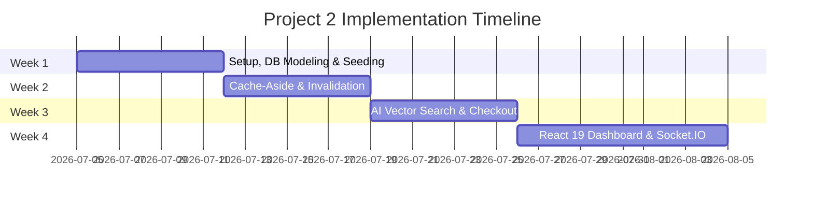

# INFOTACT SOLUTIONS & CO.
## PROJECT 2: High-Performance E-Commerce Engine with AI Vector Search
### TEAM MASTER DOCUMENT — MONTH 2 (July 2026)

**Tech Stack**: TypeScript | React 19 | Vite 7 | Tailwind CSS v4 | Node.js | Express | Socket.IO | Redis | MongoDB + Mongoose | Docker

---

## 1. TEAM COMPOSITION & ROLES

For Project 2, the team consists of exactly two members. Responsibilities are split strictly between Backend (System Design, Database, Caching, AI, DevOps) and Frontend (UX, State, UI, Real-time client integration).

| Member | Role & Ownership | Branch |
| :--- | :--- | :--- |
| **You (Tech Lead)** | Backend | Database, REST API, Redis Caching + Cache Invalidation, AI Vector Search (Embeddings), Order Aggregation Pipelines, Secure Decrements, WebSockets (Backend), Docker, CI/CD | `feature/backend` |
| **Dinesh Kumar** | Frontend | Storefront & Catalog Grid, Semantic Search UI, Cart Drawer State, Checkout Page, Admin Catalog Dashboard, Live Stock Badges, WebSockets (Client) | `feature/dinesh` |

---

## 2. INFOTACT PROGRAM RULES & CRITICAL DEADLINES

### 2.1 Program Structure (Month 2)
The project is broken into 4 weekly implementation phases starting on the **5th of July 2026**.

| Parameter | Details |
| :--- | :--- |
| **Program Start** | 5th July 2026 |
| **Month 2 Scope** | Project 2: High-Performance E-Commerce Engine with AI Vector Search |
| **Review Cycle** | 2 reviews per month — Mid Review + Final Review |
| **Evaluation Basis** | 4 weeks of GitHub commits MANDATORY. Monolithic push = DISQUALIFIED. |
| **Zero Gap Commit Rule** | **Zero days without commits.** Every day (including weekends) requires at least one commit. |
| **Work Distribution Doc** | This document serves as the official distribution reference. |
| **Dashboard** | Connect GitHub repo at [https://infotact.in/dashboard/project-progress](https://infotact.in/dashboard/project-progress) |

### 2.2 Monthly & Weekly Schedule (Month 2)
*Dates are set for July – August 2026.*

| Week | Dates | Focus |
| :--- | :--- | :--- |
| **Week 1** | 5th to 11th July | Environment Setup + Database Seeding (Thousands of mock products) |
| **Week 2** | 12th to 18th July | Implementing the Cache-Aside Pattern + Caching Invalidation |
| **Week 3** | 19th to 25th July | Vector Search + Advanced Mongoose Queries & Order Aggregations |
| **Week 4** | 26th July to 4th Aug | Vite/React 19 Admin Dashboard + Socket.IO Live Updates + CI/CD |
| **Mid Review** | 20th to 27th July | Weeks 1+2 evaluated — **Must have 10 commit days in the last 14 days.** |
| **Final Review** | 5th to 10th Aug | Weeks 3+4 evaluated — **Must have 20 commit days in total, NO GAPS.** |

> [!IMPORTANT]
> **ZERO GAP COMMIT RULE:** Team repository must have commits on ALL 20 days with NO GAPS. Even on weekends, at minimum a README update, config fix, or code documentation commit is required. Missing even 1 day in the 20-day window = project marked incomplete.

---

## 3. PRODUCTION-GRADE USPs (ELEVATING TO ENTERPRISE STANDARD)

To make this project stand out as a top-notch engineering feat rather than a simple tutorial app, we implement advanced industry-standard patterns:

* **U1: Offline AI Vector Generation (Local Hugging Face Pipeline)**
  Instead of hardcoded fake arrays, the backend uses **`@xenova/transformers` (Transformers.js)** to run a local sentence-similarity pipeline (`Xenova/all-MiniLM-L6-v2`) on the CPU. It generates real, offline 384-dimensional vector embeddings on the fly for product descriptions and search queries with zero external API fees.
* **U2: Cache-Aside with Stampede Protection & Jitter**
  Product fetches are cached in Redis with a TTL. To prevent cache stampedes (where multiple concurrent requests hit the DB when a cache expires), the script adds a randomized **Jitter** (e.g. +5% to 15% to the base TTL). Paginated query results are stored in structured keys.
* **U3: Cache Invalidation via Pattern Eviction**
  When an admin updates/creates/deletes a product, we scan and evict the specific keys (`catalog:page:*` and `product:details:*`) using Redis pipeline operations, ensuring that the database and cache stay consistent instantly.
* **U4: Double-Layered Concurrency checkout Locks (Overselling Prevention)**
  To handle flash-sale traffic (high-concurrency checkout requests):
    * **Layer 1 (Redis Mutex Lock)**: A fast Redis SETNX lock checks if a lock exists for the item during checkout.
    * **Layer 2 (Atomic MongoDB Filter)**: Updates the product inventory using Mongoose atomic selectors: `findOneAndUpdate({ _id, stock: { $gte: quantity } }, { $inc: { stock: -quantity } })`. This completely prevents overselling and negative inventory without database deadlock.
* **U5: Room-Based Socket.IO Inventory Updates**
  Websocket events broadcast stock changes to specific room IDs (e.g., specific categories or storefront viewports) so clients only receive events for products currently displayed on their screen, optimizing network overhead.
* **U6: Antigravity Dark Premium UX**
  Deep space void aesthetic (`#0A0A0F`), glowing electric violet (`#7C3AED`) and cyber cyan (`#06B6D4`) borders, glassmorphism cards, responsive storefront grids, cart drawers, checkout simulation, and single-page routing without page reloads.

---

## 4. WEEK-BY-WEEK DAILY COMMIT SCHEDULE

To ensure compliance with the **Zero Gap Commit Rule**, tasks are broken down day-by-day. 
- **Mon – Fri**: Core feature coding.
- **Sat – Sun**: Testing, documentation, seed script addition, and configuration commits.



### WEEK 1 — Environment Setup & Seed Data Generation (5th – 11th July)
**Goal:** Setup client/server monorepo, configure MongoDB schemas, create JWT authentication endpoints, and design LoginPage and SignupPage on the frontend.

| Day | Date | You (Backend / feature/backend) | Dinesh (Frontend / feature/dinesh) |
| :--- | :--- | :--- | :--- |
| **Day 1** | 5th July | Create server directories, install backend dependencies (express, typescript, mongoose, ts-node, nodemon, @types/node). | Init React 19 frontend using Vite 7 and TypeScript, setup Tailwind v4 and basic CSS directives. |
| **Day 2** | 6th July | Establish Mongoose database connection helper (`config/db.ts`) with strict TypeScript configuration. | Design global design system layout tokens in CSS, and build reusable UI components: `Button.tsx` and `Input.tsx` with focus glow. |
| **Day 3** | 7th July | Design the strict `User` schema (`models/User.ts`) with password hashing (`bcrypt`) and toJSON clean transforms. | Install `react-router-dom` and set up App routing. Scaffold `/login`, `/signup`, and `/shop` pages. |
| **Day 4** | 8th July | Design the strict `Product` schema (`models/Product.ts`) containing: `name`, `description`, `price`, `stock`, `category`, and `embedding`. | Build `LoginPage.tsx` page layout and auth form inputs with loading states. |
| **Day 5** | 9th July | Write robust database seeding script (`scripts/seed.ts`) to populate MongoDB with thousands of mock products. | Build `SignupPage.tsx` page layout and implement client-side input validation for password matching. |
| **Day 6** | 10th July (WE) | Create user registration endpoint `POST /auth/register` and login endpoint `POST /auth/login`. | Create `api.ts` axios instance and set up `AuthContext.tsx` + `useAuth.ts` hook for global auth state. |
| **Day 7** | 11th July (WE) | Document API routes in the backend `README.md` and add validation configurations. | Add form submit handlers connecting `LoginPage`/`SignupPage` to backend auth APIs. Fix styling bugs. |

---

### WEEK 2 — Cache-Aside Pattern & Catalog REST APIs (12th – 18th July)
**Goal:** Implement Redis connection, write Cache-Aside middleware logic for product catalog fetches, set up cache invalidation on product updates, and build the catalog grid UI.

| Day | Date | You (Backend / feature/backend) | Dinesh (Frontend / feature/dinesh) |
| :--- | :--- | :--- | :--- |
| **Day 1** | 12th July | Install and configure `ioredis` in `config/redis.ts`. Test connection on docker-based Redis instance. | Build base `StorefrontLayout.tsx` including top navbar navigation, filter sidebar, and main page grid area. |
| **Day 2** | 13th July | Build base product catalog routes `GET /api/products` (list products) and `GET /api/products/:id`. | Build `ProductCard.tsx` component with hover effects, card shadows, and price tags. |
| **Day 3** | 14th July | Implement Cache-Aside logic inside `GET /api/products`: check Redis for `products:all`, fallback to DB, write cache. | Create the responsive `ProductGrid.tsx` page layout and configure skeleton loaders. |
| **Day 4** | 15th July | Create cache invalidation middleware: deletes `products:all` key on admin create, update, or delete operations. | Add API call to fetch products in `ProductGrid` from `GET /api/products`, handles loading and error states. |
| **Day 5** | 16th July | Implement Admin product creation `POST /api/products` and update `PUT /api/products/:id` endpoints protected by JWT role middleware. | Build `SearchBar.tsx` component in the store header, capturing text input changes. |
| **Day 6** | 17th July (WE) | Refactor Redis caching helper into generic wrapper, write execution logs to verify sub-50ms query times. | Create sidebar filtering controls to sort products by categories and price range locally. |
| **Day 7** | 18th July (WE) | Write automated integration tests simulating API calls and verifying that product cache clears properly. Update API docs. | Add JSDoc comments to components. Verify storefront layout collapses cleanly for mobile viewports. |

---

### WEEK 3 — Vector Search & Order Aggregation (19th – 25th July)
**Goal:** Implement AI vector search queries on MongoDB, calculate order totals with mongoose aggregations, secure inventory decrement checks, and build cart and checkout pages on the client.

| Day | Date | You (Backend / feature/backend) | Dinesh (Frontend / feature/dinesh) |
| :--- | :--- | :--- | :--- |
| **Day 1** | 19th July | Create `embedding.service.ts` to convert text descriptions to embeddings using an external AI API (Hugging Face / Gemini API). | Setup `CartContext.tsx` and `useCart.ts` hook to manage client-side state (items, quantity updates). |
| **Day 2** | 20th July | Update the DB seed script to generate embeddings for mock catalog products. Write `/products/semantic-search` endpoint. | Create the slide-out `CartDrawer.tsx` component showing current items, summaries, and quantity editors. |
| **Day 3** | 21st July | Create `Order` Mongoose schema (`models/Order.ts`). Stub the purchase checkout endpoint `POST /orders`. | Integrate search input with `GET /products/semantic-search` API. Implement toggle for Keyword vs AI search. |
| **Day 4** | 22nd July | Implement Redis-based locking mechanism (`services/redisLock.service.ts`) using atomic operations. | Build `CheckoutPage.tsx` containing delivery forms, cart summaries, and checkout action triggers. |
| **Day 5** | 23rd July | Connect checkout endpoint with Redis lock: acquire lock per product, verify stock availability, decrease stock, create order, release lock. | Connect checkout page buttons to backend `POST /orders` API. Handle success notifications and out-of-stock messages. |
| **Day 6** | 24th July (WE) | Build `GET /orders/my-orders` endpoint for history lists. Write concurrent purchase test scripts to verify lock. | Add empty-cart states and custom toast notification elements when items are added/removed. |
| **Day 7** | 25th July (WE) | Document vector search and ordering API rules. Implement error codes formatting on order failures. | Refactor checkout inputs, write comments on contexts, and verify semantic search UI states. |

---

### WEEK 4 — React 19 Admin Dashboard, Socket.IO & CI/CD (26th July – 4th August)
**Goal:** Create Admin control dashboard UI, connect real-time Socket.IO stock counters, dockerize backend services, and setup GitHub CI/CD workflows.

| Day | Date | You (Backend / feature/backend) | Dinesh (Frontend / feature/dinesh) |
| :--- | :--- | :--- | :--- |
| **Day 1** | 26th July | Setup Socket.IO server configuration sharing the HTTP server port (`socket/socketServer.ts`). | Build Socket client listener utility (`hooks/useSocket.ts`) and establish connections. |
| **Day 2** | 27th July | Emit `stock:update` real-time messages on checkout events to notify active client browsers of changes. | Wire `stock:update` events to modify product stock figures inside the UI cards and details screens live. |
| **Day 3** | 28th July | Write multi-stage production `Dockerfile` for the server, and define `.dockerignore`. | Build the Vite + React 19 Admin Catalog dashboard (`AdminProductsPage.tsx`) showing products list and delete actions. |
| **Day 4** | 29th July | Configure GitHub Actions CI workflow (`.github/workflows/main.yml`) checking server builds and linter errors. | Build the price update form interface (`EditPriceForm.tsx`) and link it to backend Admin update endpoint. |
| **Day 5** | 30th July | Review codebases, clean residual print logs, and run local build checks to verify strict typing. | Create the checkout order success splash page showing order codes and confirmation animations. |
| **Day 6** | 31st July (WE) | Merge backend branches into main, resolve conflicts, and test end-to-end local routing. | Merge frontend branches into main. Resolve conflicts. |
| **Day 7** | 1st Aug (WE) | Draft detailed architecture visual diagrams in the root README.md. | Audit CSS styling guidelines for compliance with Tailwind v4 variables. |
| **Day 8** | 2nd Aug | Verify server runs inside docker containers. Draft env template files. | Perform end-to-end flow checks: register -> search (semantic) -> checkout -> live stock update check. |
| **Day 9** | 3rd Aug | Optimize DB indexing for vectors search and add performance logging. | Optimize component image sizes, clean warnings, and build final client bundle. |
| **Day 10**| 4th Aug | Finalize presentation walkthroughs, verification reports, and review scripts. | Assist in writing demo scripts and layout screenshots formatting. |

---

## 5. MANDATORY FOLDER STRUCTURE (DO NOT DEVIATE)

To avoid merge conflicts and structure codebase cleanly, this directory architecture is locked:

```
infotact-project2/
├── .github/
│   └── workflows/
│       └── main.yml           # CI/CD: lint + build validation on push
├── client/                     # React 19 + Vite 7 + Tailwind v4
│   ├── public/
│   │   └── favicon.svg
│   ├── src/
│   │   ├── assets/
│   │   │   └── logo.svg
│   │   ├── components/
│   │   │   ├── auth/
│   │   │   │   ├── LoginForm.tsx
│   │   │   │   └── SignupForm.tsx
│   │   │   ├── shop/
│   │   │   │   ├── ProductCard.tsx
│   │   │   │   ├── ProductGrid.tsx
│   │   │   │   └── SearchBar.tsx
│   │   │   ├── checkout/
│   │   │   │   ├── CartDrawer.tsx
│   │   │   │   └── CheckoutForm.tsx
│   │   │   ├── admin/
│   │   │   │   ├── ProductTable.tsx
│   │   │   │   └── EditPriceForm.tsx
│   │   │   └── ui/
│   │   │       ├── Button.tsx
│   │   │       ├── Input.tsx
│   │   │       ├── Spinner.tsx
│   │   │       └── Toast.tsx
│   │   ├── context/
│   │   │   ├── AuthContext.tsx
│   │   │   └── CartContext.tsx
│   │   ├── hooks/
│   │   │   ├── useAuth.ts
│   │   │   ├── useCart.ts
│   │   │   └── useSocket.ts
│   │   ├── pages/
│   │   │   ├── LoginPage.tsx
│   │   │   ├── SignupPage.tsx
│   │   │   ├── StorefrontPage.tsx
│   │   │   ├── AdminProductsPage.tsx
│   │   │   └── OrderHistoryPage.tsx
│   │   ├── services/
│   │   │   ├── api.ts          # Axios client instance
│   │   │   └── socket.ts       # Socket.IO client initialization
│   │   ├── types/
│   │   │   └── index.ts        # Share TS interfaces
│   │   ├── App.tsx
│   │   ├── main.tsx
│   │   └── index.css          # Tailwind CSS v4 variables & directives
│   ├── tailwind.config.ts
│   ├── vite.config.ts
│   └── tsconfig.json
├── server/                     # Node.js + Express + TypeScript
│   ├── src/
│   │   ├── config/
│   │   │   ├── db.ts           # Mongoose configuration
│   │   │   └── redis.ts        # Redis client wrapper
│   │   ├── models/
│   │   │   ├── User.ts
│   │   │   ├── Product.ts
│   │   │   └── Order.ts
│   │   ├── middleware/
│   │   │   ├── auth.ts         # verifyToken + requireAdmin
│   │   │   └── cache.ts        # Catalog cache middlewares
│   │   ├── services/
│   │   │   ├── embedding.service.ts # text-to-vector service
│   │   │   └── redisLock.service.ts # Redis SETNX lock utility
│   │   ├── routes/
│   │   │   ├── auth.routes.ts
│   │   │   ├── product.routes.ts
│   │   │   └── order.routes.ts
│   │   ├── socket/
│   │   │   └── socketServer.ts # socket.io configuration
│   │   ├── types/
│   │   │   └── index.ts        # Typed Express requests/response objects
│   │   ├── scripts/
│   │   │   └── seed.ts         # Catalog mock database seeder (generates thousands)
│   │   └── index.ts            # Server entrypoint
│   ├── Dockerfile
│   ├── .dockerignore
│   ├── tsconfig.json
│   └── package.json
├── README.md
└── .gitignore
```

---

## 6. KEY CODE REFERENCES & ARCHITECTURE PATTERNS

### 6.1 Mongoose Product Model with Embeddings (Backend)
`server/src/models/Product.ts`
```typescript
import mongoose, { Schema, Document } from "mongoose";

export interface IProduct extends Document {
  name: string;
  description: string;
  price: number;
  stock: number;
  category: string;
  embedding: number[]; // Array containing vector representation (e.g. length 384)
}

const ProductSchema = new Schema<IProduct>({
  name: { type: String, required: true, trim: true },
  description: { type: String, required: true },
  price: { type: Number, required: true, min: 0 },
  stock: { type: Number, required: true, min: 0 },
  category: { type: String, required: true },
  embedding: { type: [Number], required: true }
}, { timestamps: true });

// Transform output to delete internal fields
ProductSchema.set("toJSON", {
  transform: (_, ret: Record<string, any>) => {
    ret.id = ret._id;
    delete ret._id;
    delete ret.__v;
    delete ret.embedding; // Embeddings are hidden from standard catalog fetches
    return ret;
  }
});

export default mongoose.model<IProduct>("Product", ProductSchema);
```

### 6.2 Redis Distributed Inventory Lock (Backend)
`server/src/services/redisLock.service.ts`
```typescript
import { redisClient } from "../config/redis.js";

/**
 * Attempt to acquire a lock for a product ID during checkout
 * @param productId Product identity string
 * @param ttlSeconds Lock expiry time
 * @returns Boolean representing lock success
 */
export const acquireLock = async (productId: string, ttlSeconds: number = 5): Promise<boolean> => {
  const lockKey = `lock:product:${productId}`;
  const acquired = await redisClient.set(lockKey, "locked", "EX", ttlSeconds, "NX");
  return acquired === "OK";
};

export const releaseLock = async (productId: string): Promise<void> => {
  const lockKey = `lock:product:${productId}`;
  await redisClient.del(lockKey);
};
```

### 6.3 Semantic Vector Search Query Handler (Backend)
`server/src/routes/product.routes.ts`
```typescript
import { Router, Request, Response } from "express";
import Product from "../models/Product.js";
import { getEmbedding } from "../services/embedding.service.js";

const router = Router();

router.get("/semantic-search", async (req: Request, res: Response) => {
  try {
    const { query } = req.query;
    if (!query || typeof query !== "string") {
      return res.status(400).json({ error: "Query parameter is required" });
    }

    // 1. Generate search embedding using local offline pipeline
    const searchVector = await getEmbedding(query);

    // 2. Perform Cosine Similarity Search via MongoDB Atlas Vector Search
    const results = await Product.aggregate([
      {
        $search: {
          index: "vector_index",
          knnBeta: {
            vector: searchVector,
            path: "embedding",
            k: 10
          }
        }
      },
      {
        $project: {
          name: 1,
          description: 1,
          price: 1,
          stock: 1,
          category: 1,
          score: { $meta: "searchScore" }
        }
      }
    ]);

    res.json(results);
  } catch (error) {
    res.status(500).json({ error: "Semantic search execution failed" });
  }
});

export default router;
```

---

## 7. GITHUB WORKFLOW, PR TEMPLATE & SETUP CHECKLIST

### 7.1 Day 1 Team Setup Actions
1. **You** create the GitHub repository: `infotact-project2` (public).
2. **You** add Dinesh (`dinesh`) as a repository collaborator.
3. **You** push the initial workspace scaffold containing `client/`, `server/`, `README.md`, and `.gitignore`.
4. **You** create the development branches: `feature/backend` and `feature/dinesh`.
5. **Dinesh** clones the repository, checks out the `feature/dinesh` branch, and runs the first client setup commit.
6. Connect branches to the Infotact dashboard: [https://infotact.in/dashboard/project-progress](https://infotact.in/dashboard/project-progress)

### 7.2 Commit Message Rules (Strict)
Every commit message must be structured semantically and references the corresponding issue task.
* **Format:** `<prefix>: <description> (fixes #<issue_id>)`
* **Prefixes:**
  * `feat:` (New feature or endpoint implementation)
  * `fix:` (Bug fixes)
  * `chore:` (Config, dependencies updates)
  * `docs:` (Documentation, README updates)
  * `style:` (UI/CSS styling updates)
  * `refactor:` (Code structural revisions)
  * `test:` (Writing/editing unit and integration checks)

### 7.3 Pull Request Template
*Use this template when submitting branch PR merges at the end of each week:*
```markdown
## Week [N] PR — [Your Name]

### Summary
Brief description of this week's progress.

### Core Changes
- [ ] Backend endpoint / Frontend component 1 implemented
- [ ] Caching logs / Carts logic added
- [ ] Integration validation completed

### Architectural Notes
Detail any significant performance decisions (e.g. cache TTL values, locking bounds).

### Closed Issues
Fixes #X, Fixes #Y

### Screenshots / Demo / Terminal Output
(Upload screenshots of UI or terminal logs demonstrating test successes)
```

---

## 8. FRONTEND DESIGN SYSTEM (ANTIGRAVITY DARK)

To maintain a consistent premium look, Dinesh must enforce these styling properties using Tailwind v4 custom variables:

| CSS Variable | Color Token | Value |
| :--- | :--- | :--- |
| `--bg-primary` | Deep Dark Space Void | `#0A0A0F` |
| `--bg-surface` | Glassmorphic Panel | `#111118` (with `backdrop-filter: blur(12px)`) |
| `--accent-primary` | Electric Violet | `#7C3AED` |
| `--accent-secondary`| Cyber Cyan | `#06B6D4` |
| `--accent-success`  | Live online / Active stock | `#10B981` |
| `--text-primary`    | Off-White | `#F1F5F9` |
| `--text-muted`      | Gray Muted | `#64748B` |
| `--border`          | Dark border border | `#1E293B` |

---

## 9. LOCAL DEVELOPMENT PORT CHECKS
* **Backend API server**: `http://localhost:5000`
* **Vite React Client app**: `http://localhost:5173`
* **Redis Instance**: `http://localhost:6379`
* **MongoDB**: `mongodb://localhost:27017/infotact_project2`

---
**INFOTACT PROJECT 2 — TEAM MASTER DOCUMENT**
Prepared for: Backend SDE Intern (You) & Dinesh Kumar (Frontend SDE Intern)
June 2026 — Infotact Technical Internship Program
